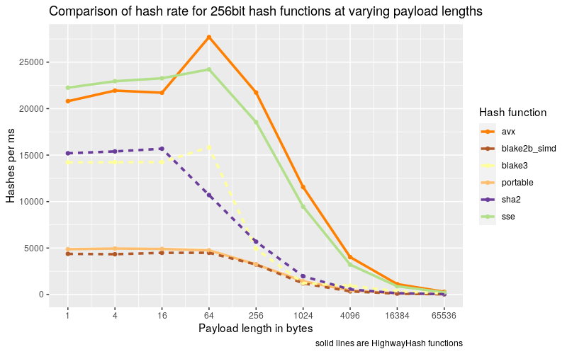

 [](https://docs.rs/highway) [](https://github.com/nickbabcock/highway-rs) [](https://crates.io/crates/highway)

# Highway-rs

This crate is a native Rust port of [Google's
HighwayHash](https://github.com/google/highwayhash), which is a fast, keyed,
portable (output is hardware independent) and strong hash function.

## Features

 - ✔ pure / stable rust
 - ✔ zero dependencies
 - ✔ generate 64, 128, and 256bit hashes
 - ✔ > 10 GB/s with SIMD (SSE 4.1 AVX 2, NEON) aware instructions on x86 and aarch64 architectures
 - ✔ > 3 GB/s on Wasm with the Wasm SIMD extension
 - ✔ > 1 GB/s portable implementation with zero unsafe code
 - ✔ incremental / streaming hashes
 - ✔ zero heap allocations
 - ✔ `no_std` compatible
 - ✔ fuzzed against reference implementation to ensure stability and compatibility

## Caution

`HighwayHash` (the algorithm) has not undergone extensive cryptanalysis like SipHash (the default hashing algorithm in Rust), but according to the authors, HighwayHash output bits are uniformly distributed and should withstand differential and rotational attacks. Hence HighwayHash is referred to as a strong hash function, not a cryptographic hash function. I encourage anyone interested to [peruse the paper](https://arxiv.org/abs/1612.06257) to understand the risks.

## Examples

The quickest way to get started:

```rust
use highway::{HighwayHasher, HighwayHash};
let res: u64 = HighwayHasher::default().hash64(&[]);
let res2: [u64; 2] = HighwayHasher::default().hash128(&[]);
let res3: [u64; 4] = HighwayHasher::default().hash256(&[]);
```

A more complete tour of the API follows:

```rust
use highway::{HighwayHasher, HighwayHash, Key};

// HighwayHash requires a key that should be hidden from attackers
// to ensure outputs are unpredictable, so attackers can't mount
// DoS attacks.
let key = Key([1, 2, 3, 4]);

// A HighwayHasher is the recommended approach to hashing,
// as it will select the fastest algorithm available
let mut hasher = HighwayHasher::new(key);

// Append some data
hasher.append(&[255]);

// After all data has been appended, you ask for
// 64, 128, or 256bit output. The hasher is consumed
// after finalization.
let res: u64 = hasher.finalize64();

assert_eq!(0x07858f24d_2d79b2b2, res);
```

Creating a 128bit and 256bit hash is just as simple.

```rust
use highway::{HighwayHasher, HighwayHash, Key};

// Generate 128bit hash
let key = Key([1, 2, 3, 4]);
let mut hasher128 = HighwayHasher::new(key);
hasher128.append(&[255]);
let res128: [u64; 2] = hasher128.finalize128();
assert_eq!([0xbb007d2462e77f3c, 0x224508f916b3991f], res128);

// Generate 256bit hash
let key = Key([1, 2, 3, 4]);
let mut hasher256 = HighwayHasher::new(key);
hasher256.append(&[255]);
let res256: [u64; 4] = hasher256.finalize256();
let expected: [u64; 4] = [
    0x7161cadbf7cd70e1,
    0xaac4905de62b2f5e,
    0x7b02b936933faa7,
    0xc8efcfc45b239f8d,
];
assert_eq!(expected, res256);
```

Use highway hash in standard rust collections

```rust
use std::collections::HashMap;
use highway::{HighwayBuildHasher, Key};
let mut map =
  HashMap::with_hasher(HighwayBuildHasher::new(Key([
    0xcbf29ce484222325,
    0xc3a5c85c97cb3127,
    0xb492b66fbe98f273,
    0x9ae16a3b2f90404f,
  ])));

map.insert(1, 2);
assert_eq!(map.get(&1), Some(&2));
```

Or if utilizing a key is not important, one can use the default

```rust
use std::collections::HashMap;
use std::hash::BuildHasherDefault;
use highway::HighwayHasher;
let mut map =
  HashMap::with_hasher(BuildHasherDefault::<HighwayHasher>::default());

map.insert(1, 2);
assert_eq!(map.get(&1), Some(&2));
```

Hashing a file, or anything implementing `Read`

```rust
use std::hash::Hasher;
use highway::{PortableHash, HighwayHash};

let mut file = &b"hello world"[..];
let mut hasher = PortableHash::default();
std::io::copy(&mut file, &mut hasher)?;
let hash64 = hasher.finish(); // core Hasher API
let hash256 = hasher.finalize256(); // HighwayHash API
```

## Use Cases

`HighwayHash` can be used against untrusted user input where weak hashes can't be used due to exploitation, verified cryptographic hashes are too slow, and a strong hash function meets requirements. Some specific scenarios given by the authors of HighwayHash:

- Use 64bit hashes to for authenticating short lived messages
- Use 256bit hashes for checksums. Think file storage (S3) or any longer lived data where there is a need for strong guarantees against collisions.

`HighwayHash` may not be a good fit if the payloads trend small (< 100 bytes) and speed is up of the utmost importance, as HighwayHash hits its stride at larger payloads.

## Wasm SIMD

When deploying HighwayHash to a Wasm environment, one can opt into using the Wasm SIMD instructions by adding a Rust flag:

```bash
RUSTFLAGS="-C target-feature=+simd128" wasm-pack build
```

Then `HighwayHasher` will automatically defer to the Wasm SIMD implementation via `WasmHash`.

Once opted in, the execution environment must support Wasm SIMD instructions, which Chrome, Firefox, and Node LTS have stabilized since mid-2021. The opt in is required as there is not a way for Wasm to detect SIMD capabilities at runtime. The mere presence of Wasm SIMD instructions will cause incompatible environments to fail to compile, so it is recommended to provide two Wasm payloads to downstream users: one with SIMD enabled and one without.

### `no_std` crates

This crate has a feature, `std`, that is enabled by default. To use this crate
in a `no_std` context, add the following to your `Cargo.toml`:

```toml
[dependencies]
highway = { version = "x", default-features = false }
```

Be aware that the `no_std` version is unable to detect CPU features and so will always default to the portable implementation. If building for a known SSE 4.1 or AVX 2 machine (and the majority of machines in the last decade will support SSE 4.1), then explicitly enable the target feature:

```bash
RUSTFLAGS="-C target-feature=+sse4.1" cargo test
RUSTFLAGS="-C target-feature=+avx2" cargo test
```

## Benchmarks

Benchmarks are ran with the following command:

```bash
(cd compare && cargo clean && RUSTFLAGS="-C target-cpu=native" cargo bench)
find ./compare/target -wholename "*/new/raw.csv" -print0 | xargs -0 xsv cat rows > assets/highway.csv
```

And can be analyzed with the [R script](assets/analysis.R) found in the assets directory

Keep in mind, benchmarks will vary by machine. Newer machines typically handle AVX payloads better than older.

We'll first take a look at the throughput when calculating the 64bit hash of a varying payload with various implementations


Takeaways:

- The lower left corner of the graph illustrates HighwayHash's weakness: small payloads, as with a bit of squinting, one can see that HighwayHash ranks amongst the bottom.
- At larger payloads, HighwayHash can be competitive in performance as the CPU has room to stretch its proverbial SIMD legs on the input.
- AHash and t1ha perform fantastically and should be in one's toolkit for in memory data structures.

Now taking a look at calculating a 256bit hash value, we see a similar story.


Takeaways:

- HighwayHash is by far the fastest compared to the other functions, but if one needs a cryptographic hash, then BLAKE3 should be chosen

Even with the best eyesight, the differences are indistinguishable at smaller payloads, so let's look at the hash rate: 



Takeaways:

- At smaller payloads HighwayHash maintains its performance lead

HighwayHash uses more rounds of permutation when finalizing the 256bit output compared to the 64bit and this is reflected in the following graphic:


Takeaways:

- At max, the 64bit hash can be computed 33% faster than the 256bit output
- After 64KiB there is no performance difference between 64bit and 256bit outputs 

For those more into numbers and are curious about specifics or want more details about the hash functions at small payloads size, here is a table that breaks down throughput (in GB/s) at all payload sizes


### Builder Benchmarks

Have fun running the builder benchmarks to see how performance differs with flags:

*Default compilation*

```bash
cargo bench -- highway-builder
```

*Explicitly disable avx2*

```bash
RUSTFLAGS="-C target-feature=-avx2" cargo bench -- highway-builder
```

*Explicitly disable avx2 when targeting native cpu*

```bash
RUSTFLAGS="-C target-cpu=native -C target-feature=+sse4.1,-avx2" \
  cargo bench -- highway-builder
```
