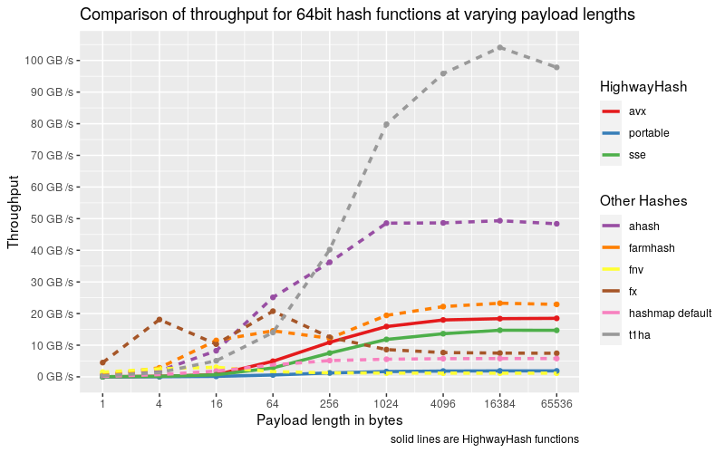
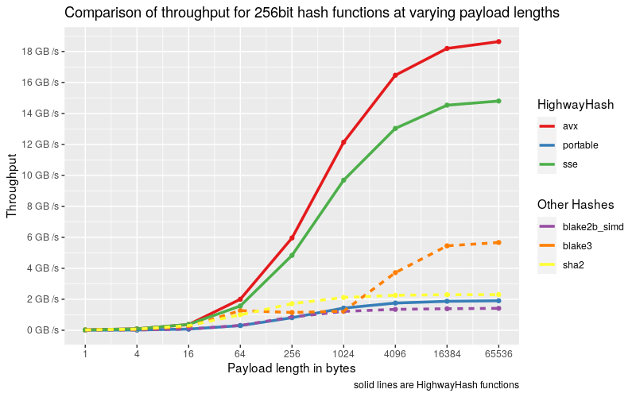
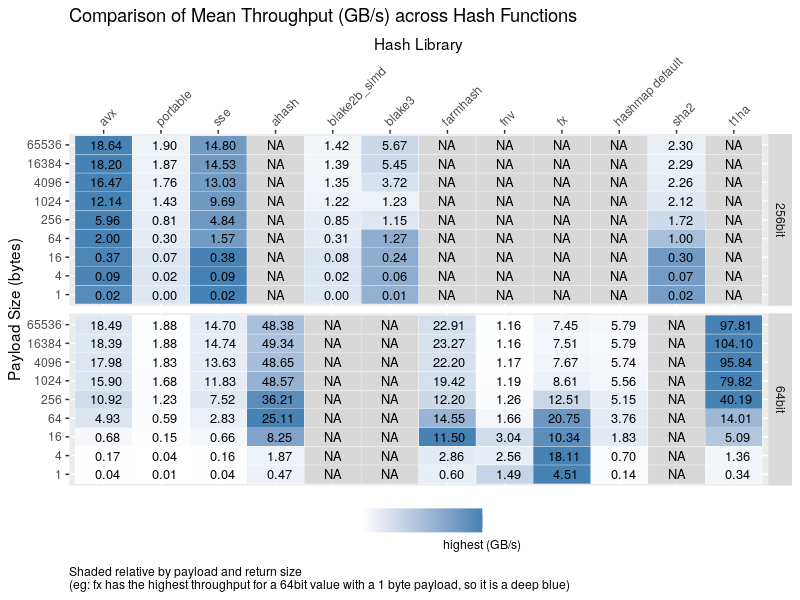

# Highway-rs

This crates is a native Rust port of [Google's HighwayHash](https://github.com/google/highwayhash), which is a strong hash function that can take advantage of SIMD instructions (SSE 4.1 and AVX 2) for speed ups that allow it to be faster than all cryptographic hash functions and even outpace less secure functions at large payloads ([benchmarks](#benchmarks)). HighwayHash allows for an incremental approach to hashing and can output 64bit, 128bit, and 256bit values.

## Benchmarks

Benchmarks are ran with the following command:

```bash
RUSTFLAGS="-C target-cpu=native" cargo bench
find ./target -wholename "*/new/raw.csv" -print0 | xargs -0 xsv cat rows > assets/highway.csv
```

And can be analyzed with the R script found in the assets directory

Keep in mind, benchmarks will vary by machine. Newer machines typically handle AVX payloads better than older.

We'll first take a look at the throughput when calculating the 64bit hash of a varying payload with various implementations



HighwayHash is not meant to be fast for extremely short payloads, as we can see that it falls short of fnv and Farmhash. HighwayHash has a series of rounds executed when the hash value is finally computed that permutes internal state, and the computation occurs at any payload size. This overhead is where the vast majority of time is spent at shorter payloads. At larger payload sizes we see HighwayHash as one of the top leaders. Some may find HighwayHash more desirable than Farmhash due to HighwayHash offering itself as a strong hash function and having a 256bit output.

Now taking a look at calculating a 256 hash value, we see a similar story.



HighwayHash is slow and comparable to other functions, but HighwayHash shines at larger payloads.

What should be noted is that there is a performance difference between calculating the 64bit and 256bit HighwayHash due to the 256bit requiring more rounds of permutation. The graph below depicts these differences.


Up until 1024 bytes, calculating the 64bit hash is twice as fast when using SIMD instructions; however by 16KiB both implementations reach the same steady state across all implementations.

For those more into numbers and are curious about specifics or want more details about the hash functions at small payloads size, here is a table that breaks down (GB/s) at all payload sizes



