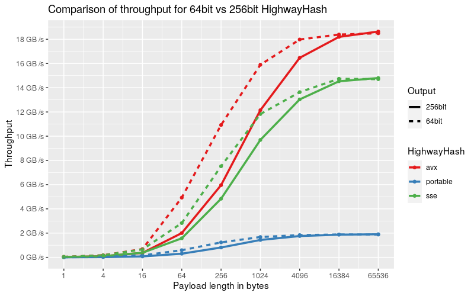

 [](https://docs.rs/highway) [](https://github.com/nickbabcock/highway-rs) [](https://crates.io/crates/highway)

# Highway-rs

This crate is a native Rust port of [Google's
HighwayHash](https://github.com/google/highwayhash), which is a fast, keyed, and strong hash
function.

## Features

 - ✔ pure / stable rust
 - ✔ zero dependencies
 - ✔ generate 64, 128, and 256bit hashes
 - ✔ > 10 GB/s with SIMD (SSE 4.1 & AVX 2) aware instructions on x86 architectures
 - ✔ > 1 GB/s portable implementation with zero unsafe code
 - ✔ incremental / streaming hashes
 - ✔ zero heap allocations
 - ✔ `no_std` compatible
 - ✔ fuzzed against reference implementation to ensure stability and compatibility

## Caution

HighwayHash (the algorithm) has not undergone extensive cryptanalysis like SipHash (the default hashing algorithm in Rust), but according to the authors, HighwayHash output bits are uniformly distributed and should withstand differential and rotational attacks. Hence HighwayHash is referred to as a strong hash function, not a cryptographic hash function. I encourage anyone interested to [peruse the paper](https://arxiv.org/abs/1612.06257) to understand the risks.

## Examples

The quickest way to get started:

```rust
use highway::{HighwayHasher, HighwayHash};
let res: u64 = HighwayHasher::default().hash64(&[]);
let res2: [u64; 2] = HighwayHasher::default().hash128(&[]);
let res3: [u64; 4] = HighwayHasher::default().hash256(&[]);
```

A more complete tour of the API follows:

```rust
use highway::{HighwayHasher, HighwayHash, Key};

// HighwayHash requires a key that should be hidden from attackers
// to ensure outputs are unpredictable, so attackers can't mount
// DoS attacks.
let key = Key([1, 2, 3, 4]);

// A HighwayHasher is the recommended approach to hashing,
// as it will select the fastest algorithm available
let mut hasher = HighwayHasher::new(key);

// Append some data
hasher.append(&[255]);

// After all data has been appended, you ask for
// 64, 128, or 256bit output. The hasher is consumed
// after finalization.
let res: u64 = hasher.finalize64();

assert_eq!(0x07858f24d_2d79b2b2, res);
```

Creating a 128bit and 256bit hash is just as simple.

```rust
use highway::{HighwayHasher, HighwayHash, Key};

// Generate 128bit hash
let key = Key([1, 2, 3, 4]);
let mut hasher128 = HighwayHasher::new(key);
hasher128.append(&[255]);
let res128: [u64; 2] = hasher128.finalize128();
assert_eq!([0xbb007d2462e77f3c, 0x224508f916b3991f], res128);

// Generate 256bit hash
let key = Key([1, 2, 3, 4]);
let mut hasher256 = HighwayHasher::new(key);
hasher256.append(&[255]);
let res256: [u64; 4] = hasher256.finalize256();
let expected: [u64; 4] = [
    0x7161cadbf7cd70e1,
    0xaac4905de62b2f5e,
    0x7b02b936933faa7,
    0xc8efcfc45b239f8d,
];
assert_eq!(expected, res256);
```

Use highway hash in standard rust collections

```rust
use std::collections::HashMap;
use highway::{HighwayBuildHasher, Key};
let mut map =
  HashMap::with_hasher(HighwayBuildHasher::new(Key([
    0xcbf29ce484222325,
    0xc3a5c85c97cb3127,
    0xb492b66fbe98f273,
    0x9ae16a3b2f90404f,
  ])));

map.insert(1, 2);
assert_eq!(map.get(&1), Some(&2));
```

Or if utilizing a key is not important, one can use the default

```rust
use std::collections::HashMap;
use std::hash::BuildHasherDefault;
use highway::HighwayHasher;
let mut map =
  HashMap::with_hasher(BuildHasherDefault::<HighwayHasher>::default());

map.insert(1, 2);
assert_eq!(map.get(&1), Some(&2));
```

Hashing a file, or anything implementing `Read`

```rust
use std::fs::File;
use std::hash::Hasher;
use highway::{PortableHash, HighwayHash};

let mut file = File::open("./README.md").unwrap();
let mut hasher = PortableHash::default();
std::io::copy(&mut file, &mut hasher).unwrap();
let hash64 = hasher.finish(); // core Hasher API
let hash256 = hasher.finalize256(); // HighwayHash API
```

## Use Cases

HighwayHash can be used against untrusted user input where weak hashes can't be used due to exploitation, verified cryptographic hashes are too slow, and a strong hash function meets requirements. Some specific scenarios given by the authors of HighwayHash:

- Use 64bit hashes to for authenticating short lived messages
- Use 256bit hashes for checksums. Think file storage (S3) or any longer lived data where there is a need for strong guarantees against collisions.

Highwayhash may not be a good fit if the payloads trend small (< 100 bytes) and speed is up of the utmost importance, as Highwayhash hits its stride at larger payloads.

### `no_std` crates

This crate has a feature, `std`, that is enabled by default. To use this crate
in a `no_std` context, add the following to your `Cargo.toml`:

```toml
[dependencies]
highway = { version = "x", default-features = false }
```

Be aware that the `no_std` version is unable to detect CPU features and so will always default to the portable implementation. If building for a known SSE 4.1 or AVX 2 machine (and the majority of machines in the last decade will support SSE 4.1), these hashers can still be constructed with `force_new`.

## Benchmarks

Benchmarks are ran with the following command:

```bash
cargo clean
RUSTFLAGS="-C target-cpu=native" cargo bench
find ./target -wholename "*/new/raw.csv" -print0 | xargs -0 xsv cat rows > assets/highway.csv
```

And can be analyzed with the R script found in the assets directory

Keep in mind, benchmarks will vary by machine. Newer machines typically handle AVX payloads better than older.

We'll first take a look at the throughput when calculating the 64bit hash of a varying payload with various implementations


HighwayHash is not meant to be fast for extremely short payloads, as we can see that it falls short of fnv and Farmhash. HighwayHash has a series of rounds executed when the hash value is finally computed that permutes internal state, and the computation occurs at any payload size. This overhead is where the vast majority of time is spent at shorter payloads. At larger payload sizes we see HighwayHash as one of the top leaders. Some may find HighwayHash more desirable than Farmhash due to HighwayHash offering itself as a strong hash function and having a 256bit output.

Now taking a look at calculating a 256 hash value, we see a similar story.


HighwayHash is slow and comparable to other functions, but HighwayHash shines at larger payloads.

What should be noted is that there is a performance difference between calculating the 64bit and 256bit HighwayHash due to the 256bit requiring more rounds of permutation. The graph below depicts these differences.



Up until 1024 bytes, calculating the 64bit hash is twice as fast when using SIMD instructions; however by 16KiB both implementations reach the same steady state across all implementations.

For those more into numbers and are curious about specifics or want more details about the hash functions at small payloads size, here is a table that breaks down (GB/s) at all payload sizes


### Builder Benchmarks

Have fun running the builder benchmarks to see how performance differs with flags:

*Default compilation*

```bash
cargo bench -- highway-builder
```

*Explicitly disable avx2*

```bash
RUSTFLAGS="-C target-feature=-avx2" cargo bench -- highway-builder
```

*Explicitly disable avx2 when targeting native cpu*

```bash
RUSTFLAGS="-C target-cpu=native -C target-feature=+sse4.1,-avx2" \
  cargo bench -- highway-builder
```
